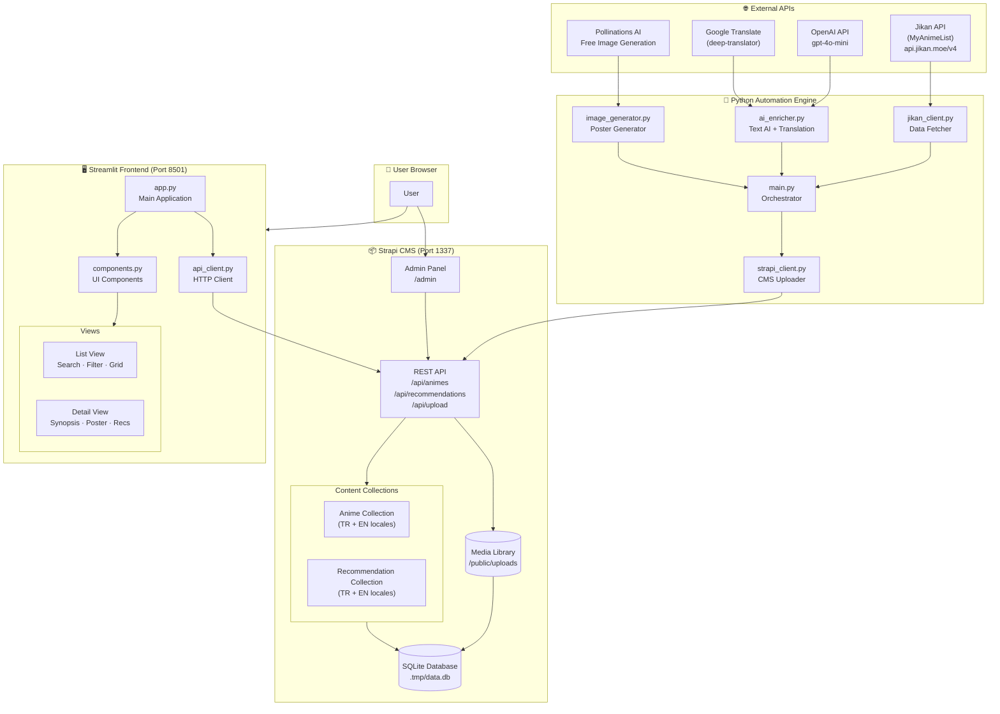
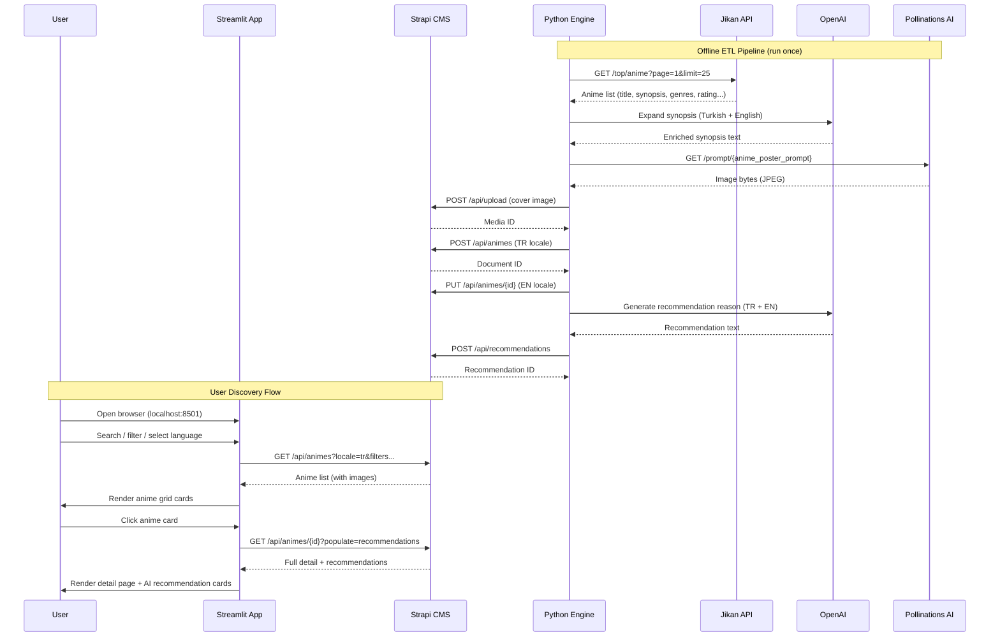

# System Architecture — AI-Powered Multilingual Anime Recommendation System

## High-Level Architecture Diagram



---

## Data Flow Sequence



---

## Component Responsibilities

| Component | Technology | Responsibility |
|-----------|------------|---------------|
| **Strapi CMS** | Node.js / TypeScript | Content storage, REST API, media library, i18n |
| **Python Engine** | Python 3.11+ | Data collection, AI enrichment, image generation, CMS population |
| **Streamlit App** | Python / Streamlit | User-facing discovery UI, search, filters, recommendations |
| **SQLite DB** | SQLite3 | Persistent storage for all CMS data |
| **Jikan API** | REST API | Free MyAnimeList data proxy (rate-limited) |
| **OpenAI** | GPT-4o-mini | Synopsis expansion, recommendation text generation |
| **Pollinations AI** | REST API | Free AI image generation (no API key required) |
| **deep-translator** | Python lib | TR↔EN translation via Google Translate |

---

## Technology Stack Summary

```
┌─────────────────────────────────────────────────────┐
│  Frontend         Streamlit 1.35+  (Python)          │
├─────────────────────────────────────────────────────┤
│  CMS Backend      Strapi 5.x       (Node.js/TS)      │
├─────────────────────────────────────────────────────┤
│  Automation       Python 3.11+                       │
│  ├─ HTTP          requests                           │
│  ├─ AI Text       openai (gpt-4o-mini)               │
│  ├─ Translation   deep-translator (Google)           │
│  └─ AI Images     Pollinations AI (REST)             │
├─────────────────────────────────────────────────────┤
│  Database         SQLite 3 (via Strapi)              │
├─────────────────────────────────────────────────────┤
│  External APIs    Jikan v4 (MyAnimeList)             │
└─────────────────────────────────────────────────────┘
```
