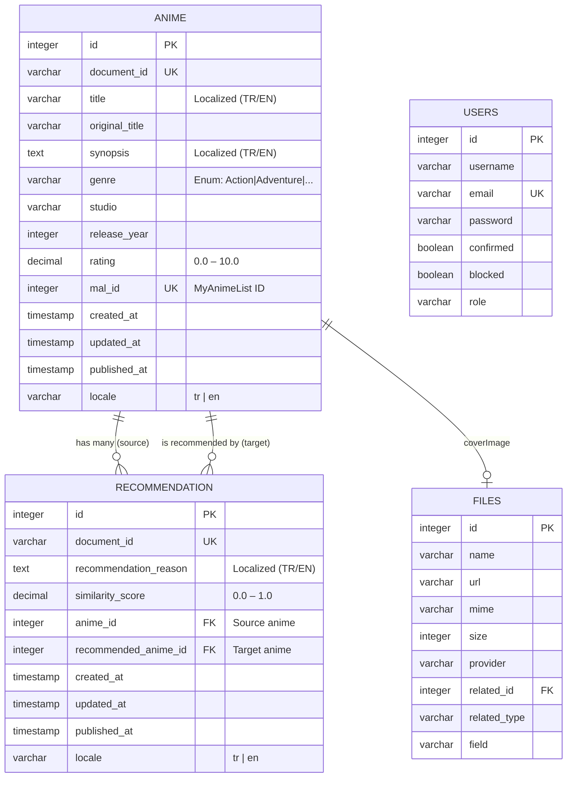

# Database Schema — AI-Powered Multilingual Anime Recommendation System

## Overview

The system uses **SQLite** (via Strapi's built-in Knex.js ORM) as its database.
Strapi manages all schema migrations automatically when content-types are defined.

---

## Entity Relationship Diagram



---

## Table Definitions

### `animes` (Strapi collection: `api::anime.anime`)

| Column | Type | Constraints | Description |
|--------|------|-------------|-------------|
| `id` | INTEGER | PK, AUTO_INCREMENT | Internal database ID |
| `document_id` | VARCHAR(255) | UNIQUE, NOT NULL | Strapi 5 document identifier |
| `title` | VARCHAR(255) | NOT NULL | Anime title (localized) |
| `original_title` | VARCHAR(255) | | Japanese/original title |
| `synopsis` | TEXT | | Full synopsis (localized) |
| `genre` | VARCHAR(50) | ENUM | One of 14 genre values |
| `studio` | VARCHAR(255) | | Animation studio name |
| `release_year` | INTEGER | CHECK (1917–2100) | Year of first broadcast |
| `rating` | DECIMAL(4,2) | CHECK (0–10) | MyAnimeList score |
| `mal_id` | INTEGER | UNIQUE | MyAnimeList entry ID |
| `created_at` | TIMESTAMP | NOT NULL | Auto-set by Strapi |
| `updated_at` | TIMESTAMP | NOT NULL | Auto-updated by Strapi |
| `published_at` | TIMESTAMP | | NULL = draft, set = published |
| `locale` | VARCHAR(10) | DEFAULT 'tr' | 'tr' or 'en' |

**Genre Enumeration Values:**
`Action` · `Adventure` · `Comedy` · `Drama` · `Fantasy` · `Horror` · `Mecha` · `Mystery` · `Romance` · `Sci-Fi` · `Slice of Life` · `Sports` · `Supernatural` · `Thriller`

---

### `recommendations` (Strapi collection: `api::recommendation.recommendation`)

| Column | Type | Constraints | Description |
|--------|------|-------------|-------------|
| `id` | INTEGER | PK, AUTO_INCREMENT | Internal database ID |
| `document_id` | VARCHAR(255) | UNIQUE, NOT NULL | Strapi 5 document identifier |
| `recommendation_reason` | TEXT | NOT NULL | AI-generated explanation (localized) |
| `similarity_score` | DECIMAL(3,2) | CHECK (0–1) | Jaccard genre similarity |
| `anime_id` | INTEGER | FK → animes.id | Source anime |
| `recommended_anime_id` | INTEGER | FK → animes.id | Recommended anime |
| `created_at` | TIMESTAMP | NOT NULL | |
| `updated_at` | TIMESTAMP | NOT NULL | |
| `published_at` | TIMESTAMP | | |
| `locale` | VARCHAR(10) | DEFAULT 'tr' | 'tr' or 'en' |

---

### `files` (Strapi Media Library)

| Column | Type | Description |
|--------|------|-------------|
| `id` | INTEGER PK | |
| `name` | VARCHAR(255) | Filename |
| `url` | VARCHAR(500) | Path relative to /public |
| `mime` | VARCHAR(100) | e.g. `image/jpeg` |
| `size` | DECIMAL | File size in KB |
| `width` | INTEGER | Image width |
| `height` | INTEGER | Image height |
| `provider` | VARCHAR | `local` |
| `related_id` | INTEGER | Linked entry ID |
| `related_type` | VARCHAR | e.g. `api::anime.anime` |
| `field` | VARCHAR | e.g. `coverImage` |

---

## Relationships

```
Anime (1) ──────── (many) Recommendation  [recommendations field]
                              │
Anime (1) ──────── (many) Recommendation  [recommendedAnime field]
Anime (1) ──────── (0..1) File            [coverImage field]
```

### One-to-Many: Anime → Recommendations
- One anime can have **multiple recommendations** (it is the "source")
- Each recommendation belongs to exactly **one** source anime
- `recommendations.anime_id` = FK to `animes.id`

### Many-to-One: Recommendation → Recommended Anime
- Each recommendation points to exactly **one** target anime
- `recommendations.recommended_anime_id` = FK to `animes.id`

---

## Internationalization (i18n) in Strapi 5

Strapi 5 uses a **unified document model** for localization:

- Each anime has a single `document_id` shared across all locales
- Localized fields (`title`, `synopsis`, `recommendationReason`) are stored separately per locale
- Non-localized fields (`genre`, `studio`, `rating`, `malId`) are shared
- Default locale: **Turkish (tr)**
- Additional locale: **English (en)**

```
document_id: "abc123"
  ├── locale: "tr"  → title: "Naruto", synopsis: "Türkçe özet..."
  └── locale: "en"  → title: "Naruto", synopsis: "English synopsis..."
```

---

## SQLite File Location

```
icrik_final/
└── .tmp/
    └── data.db    ← All Strapi data stored here
```

To inspect the database directly:
```bash
sqlite3 .tmp/data.db
.tables
SELECT * FROM animes LIMIT 5;
```
