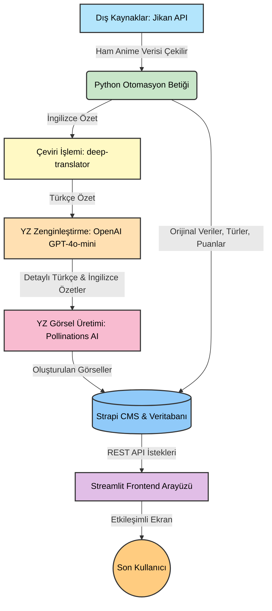

# Final Sınavı Proje Raporu

> **Öğrenci Notu:** Bu dosyayı VS Code'da açıp sağ üst köşedeki önizleme butonuna basarak görebilirsiniz. Daha sonra "Markdown PDF" eklentisiyle veya online bir dönüştürücüyle (örn: markdowntopdf.com) doğrudan PDF'e çevirebilirsiniz. Lütfen `[Köşeli Parantez]` içindeki alanları doldurmayı ve ekran görüntülerini (``) kendi bilgisayarınızdan eklemeyi unutmayın.

---

## 1. Kapak Sayfası

- **Proje Adı:** AI-Destekli Çok Dilli Anime Keşif ve Öneri Sistemi
- **Adınız:** [Adınızı Buraya Yazın]
- **Soyadınız:** [Soyadınızı Buraya Yazın]
- **Öğrenci Numaranız:** [Öğrenci Numaranızı Buraya Yazın]

---

## 2. Sistem Mimarisi Şeması

Verinin Jikan API'den alınıp, Yapay Zeka ile zenginleştirilerek Strapi CMS'e yazılması ve son olarak Streamlit arayüzünde kullanıcıya sunulmasına kadar geçen süreci anlatan akış şeması aşağıdadır:



---

## 3. Erişim Bilgileri

- **Strapi Yönetim Paneli (Admin) Linki:** https://icrik-final-strapi.onrender.com/admin
  - **Kullanıcı Adı:** [Oluşturduğunuz Admin E-postası]
  - **Şifre:** [Oluşturduğunuz Admin Şifresi]
- **Streamlit (Frontend) Arayüzünün Erişim Linki:** [Streamlit Cloud'a veya Render'a yüklediyseniz linkini yazın, yoksa "http://localhost:8501 (Yerel Sunucu)" yazın]

---

## 4. Teknik Detaylar ve Kodlar

### 4.1. Strapi Koleksiyonları, Alan Tipleri ve İlişkiler

*(Aşağıdaki yer tutuculara Strapi Admin panelinden aldığınız ekran görüntülerini ekleyin)*

**Anime Koleksiyonu Alanları:**


**Recommendation (Öneri) Koleksiyonu Alanları:**


**Koleksiyonlar Arası İlişkiler (Relations):**
*(Anime tablosundaki "recommendations" ile Recommendation tablosundaki "anime" ve "recommendedAnime" ilişkilerini gösteren ekran görüntüsü)*


### 4.2. Python Betiği ve Ana Fonksiyonların Açıklamaları

Aşağıda veriyi çeken, YZ ile zenginleştiren ve Strapi'ye yükleyen otomasyon sürecinin ana fonksiyonlarının ne işe yaradığı açıklanmıştır:

1. **Veri Toplama (`fetch_top_anime`):** Jikan API'ye (MyAnimeList'in açık API'si) HTTP istekleri atarak en popüler animelerin ham verilerini (isim, orijinal isim, ham özet, türler, stüdyo, yayın yılı, puan, kapak fotoğrafı linki) çeker. Rate-limit (istek sınırı) yememek için istekler arasına bekleme süreleri eklenmiştir.
2. **Çeviri İşlemi (`translate_text`):** Ham İngilizce anime özetlerini `deep-translator` kütüphanesi kullanarak ücretsiz bir şekilde Türkçe'ye çevirir. Bu sayede YZ'nin Türkçe bağlamı daha iyi anlaması sağlanır.
3. **YZ Görsel Üretimi (`generate_poster`):** Pollinations AI uç noktasına anime adı ve türlerini içeren sinematik bir prompt (komut) göndererek o animeye özel yüksek çözünürlüklü ve telifsiz dikey afişler üretir.
4. **Strapi'ye Yükleme (`create_anime`, `upload_image`):** Strapi'nin REST API'sine (POST istekleriyle) bağlanarak önce üretilen ve indirilen görselleri Media Library'e yükler, ardından alınan bu görsel ID'leri ile birlikte animenin hem Türkçe hem de İngilizce yerelleştirilmiş (localized) versiyonlarını CMS'e kaydeder.

**Python Ana Betiği Tam Metni (`main.py`):**

```python
import time
import requests
import os
from config import STRAPI_URL
from jikan_client import JikanClient
from ai_enricher import AIEnricher
from image_generator import ImageGenerator
from strapi_client import StrapiClient

def main():
    print("============================================================")
    print("  Anime Automation Pipeline Started")
    print("============================================================")

    # İstemcileri başlat
    jikan = JikanClient()
    ai = AIEnricher()
    img_gen = ImageGenerator()
    strapi = StrapiClient()

    # 1. Strapi'ye Giriş
    if not strapi.login():
        print("Çıkış yapılıyor...")
        return

    # 2. Önceden eklenmiş MAL ID'leri çek (tekrar eklemeyi önlemek için)
    existing_ids = strapi.get_existing_mal_ids()
    print(f"[Main] Strapi'de {len(existing_ids)} anime bulundu, atlanacak.")

    # 3. Jikan'dan animeleri çek
    NUM_ANIMES = 20
    animes = jikan.fetch_top_anime(limit=NUM_ANIMES * 2)

    processed_count = 0
    all_processed_anime = []

    # 4. Her bir animeyi işle
    for idx, anime in enumerate(animes):
        if processed_count >= NUM_ANIMES:
            break

        mal_id = anime.get('mal_id')
        title = anime.get('title')

        if mal_id in existing_ids:
            continue

        print(f"\n[Main] İşleniyor: {title}")
        print("-" * 60)

        # Çeviri ve YZ Genişletme
        tr_synopsis = ai.translate_to_turkish(anime['synopsis'])
        expanded_tr = ai.expand_synopsis(title, tr_synopsis, 'tr')
        expanded_en = ai.expand_synopsis(title, anime['synopsis'], 'en')

        # Görselleri Strapi'ye yükle
        cover_id = None
        if anime.get('image_url'):
            img_data = jikan.download_image(anime['image_url'])
            if img_data:
                fname = f"{title.replace('/', '_')}_cover.jpg"
                cover_id = strapi.upload_image(img_data, fname)

        # Pollinations AI ile yeni poster oluştur (isteğe bağlı, API ücretsizdir)
        poster_id = None
        poster_data = img_gen.generate_poster(title, anime['genre'])
        if poster_data:
             pfname = f"{title.replace('/', '_')}_ai_poster.jpg"
             poster_id = strapi.upload_image(poster_data, pfname)

        # Cover image yoksa AI poster kullan
        final_cover_id = cover_id or poster_id

        # Strapi verisini hazırla
        strapi_data = {
            'title': title,
            'original_title': anime.get('original_title'),
            'synopsis': expanded_tr,
            'genre': anime.get('genre'),
            'studio': anime.get('studio'),
            'release_year': anime.get('release_year'),
            'rating': anime.get('score'),
            'mal_id': mal_id,
            'cover_image_id': final_cover_id
        }

        # TR kaydı oluştur
        doc_id = strapi.create_anime(strapi_data, locale='tr')
        if doc_id:
            # EN çeviriyi locale olarak ekle
            en_data = {
                'title': title,
                'synopsis': expanded_en,
            }
            strapi.add_locale_to_anime(doc_id, en_data, 'en')
            strapi.publish_anime(doc_id)
            
            anime['strapi_id'] = doc_id
            all_processed_anime.append(anime)
            processed_count += 1
            
            # Rate limiting koruması
            time.sleep(1)

    print(f"\n[Main] >> {processed_count} anime başarıyla işlendi")

    # 5. YZ Tabanlı Önerileri Üret
    if len(all_processed_anime) > 1:
        print("\n[Main] Öneriler üretiliyor...")
        print("=" * 60)
        # Basit Jaccard Benzerliği Algoritması
        for i, source in enumerate(all_processed_anime):
            s_genres = set(source.get('genre', '').split(', '))
            scored = []
            for j, target in enumerate(all_processed_anime):
                if i == j: continue
                t_genres = set(target.get('genre', '').split(', '))
                
                intersection = s_genres.intersection(t_genres)
                union = s_genres.union(t_genres)
                sim = len(intersection) / len(union) if union else 0
                
                if sim > 0:
                    scored.append((sim, target))
            
            # En çok benzeyen 3 anime
            scored.sort(key=lambda x: x[0], reverse=True)
            top_3 = scored[:3]
            
            for sim_score, target in top_3:
                reason_tr = ai.generate_recommendation_reason(source['title'], target['title'], list(s_genres.intersection(set(target.get('genre', '').split(', ')))), 'tr')
                reason_en = ai.generate_recommendation_reason(source['title'], target['title'], list(s_genres.intersection(set(target.get('genre', '').split(', ')))), 'en')
                
                strapi.create_recommendation(
                    source['strapi_id'],
                    target['strapi_id'],
                    reason_tr,
                    reason_en,
                    sim_score
                )
        print(f"\n[Main] >> Öneriler başarıyla oluşturuldu.")

if __name__ == "__main__":
    main()
```

---

## 5. Sistem Kanıtları (Ekran Görüntüleri)

*(Aşağıdaki yer tutuculara Strapi'nin Öncesi/Sonrası ekran görüntülerini ekleyin)*

**Betiği Çalıştırmadan Önce (Strapi'deki Liste Boş):**


**Python Betiği Çalıştıktan Sonra (Verilerin Otomatik Dolmuş Hali):**


**Streamlit Arayüzü Çalışır Halde:**

